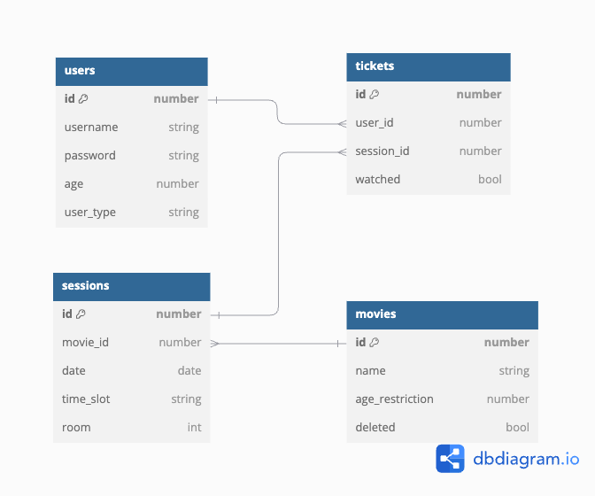

## Description

It's an API written in NestJS to implement movie management system that can:

- Authentication (with multiple user roles)
- Movie
  - Managers can add/modify/delete movies
  - Customers can list movies
- Ticket management
  - Customers can buy tickets for a movie session
  - Customers can watch movies
  - Customers can view watch history

## DB Design



## Installation

```bash
npm install
```

## Running the app

```bash
# development
$ npm run start

# watch mode
$ npm run start:dev

# production mode
$ npm run start:prod
```

## Test

```bash
# unit tests
$ npm run test

# e2e tests
$ npm run test:e2e

# test coverage
$ npm run test:cov
```
